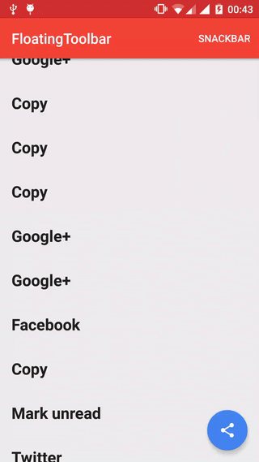
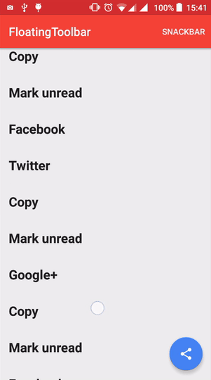

# FloatingToolbar
A toolbar that morphs from a FloatingActionButton

Inspired by the material design spec: https://www.google.com/design/spec/components/buttons-floating-action-button.html#buttons-floating-action-button-transitions

Available from API 14.




## How to use

##### 1. Add the following to your build.gradle:
```groovy
compile 'com.github.rubensousa:floatingtoolbar:1.5.1'
```
##### 2. Add FloatingToolbar as a direct child of CoordinatorLayout and before the FloatingActionButton:
```xml
<android.support.design.widget.CoordinatorLayout 
    xmlns:android="http://schemas.android.com/apk/res/android"
    xmlns:app="http://schemas.android.com/apk/res-auto"
    android:id="@+id/coordinatorLayout"
    android:layout_width="match_parent"
    android:layout_height="match_parent"
    android:fitsSystemWindows="true">
    
    <!-- Appbar -->

    <com.github.rubensousa.floatingtoolbar.FloatingToolbar
        android:id="@+id/floatingToolbar"
        android:layout_width="match_parent"
        android:layout_height="?attr/actionBarSize"
        android:layout_gravity="bottom"
        app:floatingMenu="@menu/main" />

    <android.support.design.widget.FloatingActionButton
        android:id="@+id/fab"
        android:layout_width="wrap_content"
        android:layout_height="wrap_content"
        android:layout_gravity="bottom|end"
        android:layout_margin="@dimen/fab_margin"
        android:src="@drawable/ic_share_black_24dp" />
        
        
</android.support.design.widget.CoordinatorLayout>
```
##### 3. Specify a menu resource file or custom layout with app:floatingMenu or app:floatingCustomView

You can also build a menu programmatically using FloatingToolbarMenuBuilder:

```java
 mFloatingToolbar.setMenu(new FloatingToolbarMenuBuilder(this)
                .addItem(R.id.action_unread, R.drawable.ic_markunread_black_24dp, "Mark unread")
                .addItem(R.id.action_copy, R.drawable.ic_content_copy_black_24dp, "Copy")
                .addItem(R.id.action_google, R.drawable.ic_google_plus_box, "Google+")
                .addItem(R.id.action_facebook, R.drawable.ic_facebook_box, "Facebook")
                .addItem(R.id.action_twitter, R.drawable.ic_twitter_box, "Twitter")
                .build());
```

##### 4. Attach the FAB to the FloatingToolbar to automatically start the transition on click event:

```java
mFloatingToolbar.attachFab(fab);
```

##### 5. Set a click listener
```java
mFloatingToolbar.setClickListener(new FloatingToolbar.ItemClickListener() {
            @Override
            public void onItemClick(MenuItem item) {
                
            }

            @Override
            public void onItemLongClick(MenuItem item) {

            }
        });
```

##### 6. If you want to show a snackbar in the same layout as the FloatingToolbar, please use:

```java
mFloatingToolbar.showSnackBar(snackbar);
```

##### 7. (Optional) Attach a RecyclerView to hide the FloatingToolbar on scroll:

```java
mFloatingToolbar.attachRecyclerView(recyclerView);
```

##### 8. (Optional) Use show() and hide() to trigger the transition anytime:

```java
mFloatingToolbar.show();
mFloatingToolbar.hide();
```      
  
##### 9. (Optional) Add a MorphListener to listen to morph animation events

```java
mFloatingToolbar.addMorphListener(new FloatingToolbar.MorphListener() {
    @Override
    public void onMorphEnd() {
        
    }

    @Override
    public void onMorphStart() {

    }

    @Override
    public void onUnmorphStart() {

    }

    @Override
    public void onUnmorphEnd() {

    }
});
``` 

## Attributes

- app:floatingToastOnLongClick -> boolean. Defaults to true
- app:floatingHandleFabClick -> boolean. Defaults to true
- app:floatingMenu -> Menu resource
- app:floatingItemBackground -> Drawable resource
- app:floatingCustomView -> Layout resource
- app:floatingAutoHide -> boolean. Defaults to true

## Apps using FloatingToolbar (Send a PR to add your app here)

- [EuroMillions](https://play.google.com/store/apps/details?id=io.github.rubensousa.euromillions)

## License

    Copyright 2016 Rúben Sousa
    
    Licensed under the Apache License, Version 2.0 (the "License");
    you may not use this file except in compliance with the License.
    You may obtain a copy of the License at
    
        http://www.apache.org/licenses/LICENSE-2.0
    
    Unless required by applicable law or agreed to in writing, software
    distributed under the License is distributed on an "AS IS" BASIS,
    WITHOUT WARRANTIES OR CONDITIONS OF ANY KIND, either express or implied.
    See the License for the specific language governing permissions and
    limitations under the License.
